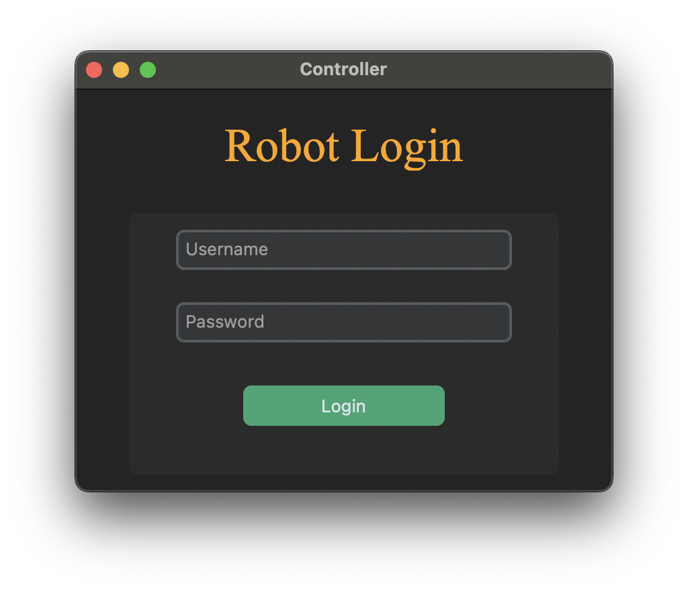
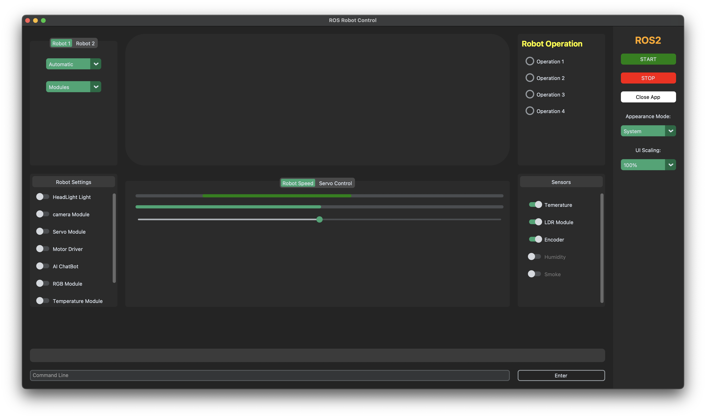
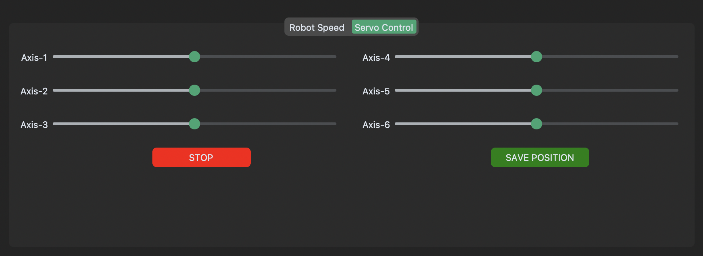

# ROS Robot Control

This Python script represents a comprehensive robot control system featuring a graphical user interface (GUI) developed with custom Tkinter. The system seamlessly incorporates a range of functionalities for precise robot control, encompassing motor movements, servo manipulation, camera surveillance, temperature sensing, and additional capabilities.


## 🛠️ Requirements

- Python 3.12.X
- pip
- [venv](https://packaging.python.org/en/latest/guides/installing-using-pip-and-virtual-environments/) (recommended)

## ⚙️ Installation

1. Clone the repository 
```bash
git clone https://github.com/HemanthReddy15/ROS-Robot-Control.git
```
2. Change the project directory
```bash
  cd ROS-Robot-Control

```
3. Install the dependencies 
```bash
  pip install Pillow customtkinter==0.3 opencv-python pyfirmata2

```
## 🤖 Running
Use the following command to Run
```bash
  python3 main.py

```
## Login Credentials
To access the application, use the following login credentials:

**Username:** 
```bash 
admin 
```
**Password:** 
```bash 
password
```

## 🕹️ Usage 
1. **Starting the Application**: Execute the script to start the Pulsanzer controller.
2. **Interaction**: Use the provided GUI elements to interact with different functionalities, such as switches, sliders, buttons, and command-line inputs.
3. **Customization**: Customize appearance modes, UI scaling, and other settings as per requirements.
4. **Controlling the Robot**: Use the manual or automatic mode to control the robot's operations based on selected tasks.

## ⚡️ Features:
- **Graphical User Interface (GUI):** The GUI provides intuitive controls for interacting with the robot system.
- **Motor Control:** Enables control over the robot's movements using arrow keys.
- **Servo Control:** Facilitates opening and closing of a box using a servo motor.
- **Camera Monitoring:** Allows live monitoring of the camera feed if the camera module is enabled.
- **Temperature Sensing:** Monitors temperature if the temperature module is enabled.
- **Command Line Interface (CLI):** Provides a command-line interface for executing commands and interacting with the system.
- **Appearance Mode and UI Scaling:** Offers options to customize the appearance mode and UI scaling according to user preferences.

## 📦 Dependencies

- [PIL](https://pypi.org/project/pillow/)
- [customtkinter](https://pypi.org/project/customtkinter/0.3/)
- [OpenCV](https://pypi.org/project/opencv-python/)
- [pyfirmata](https://pypi.org/project/pyFirmata/)

## 📝 Notes

- Ensure that the required hardware components (Arduino board, servo motor, camera, etc.) are properly connected to the system.
- Troubleshoot any connection issues with the hardware or libraries as necessary.
- Refer to the code comments for additional details on each function and module.


## Project Images
**Here are some images related to the project:**




